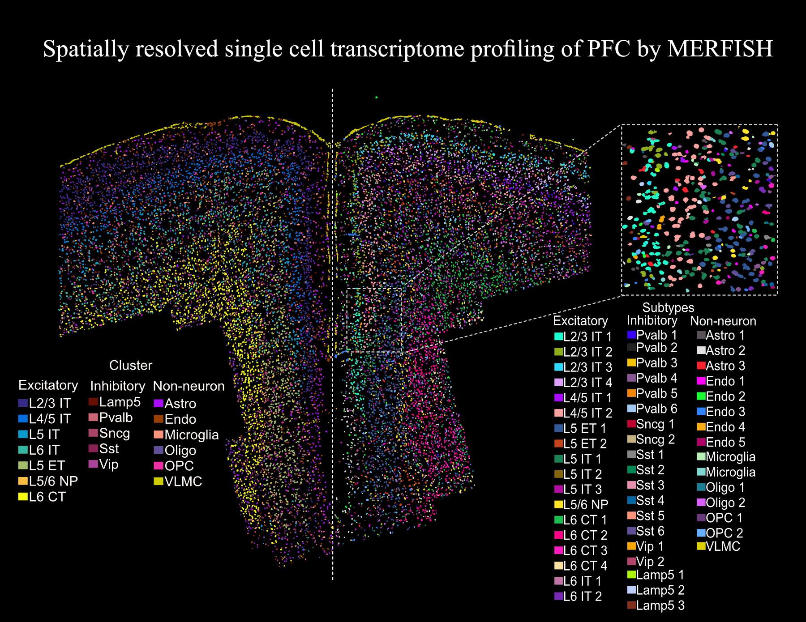

# PFC-MERFISH
## Spatially resolved single cell transcriptome profiling of mouse PFC
We employed [MERFISH](https://www.science.org/doi/10.1126/science.aaa6090), an imaging-based single cell spatial transcriptome technology, to decode organizational heterogeneity of cell in PFC.

## Dependencies
#### These scripts are based on R (version 4.0.5)
Platform: x86_64-conda-linux-gnu (64-bit).

Running under: Ubuntu 20.04.3 LTS.

#### R packges
Seurat_4.0.5, SeuratObject_4.0.2, harmony_1.0, dplyr_1.0.7, ggplot2_3.3.5, cowplot_1.1.1, wholebrain_0.1.1, iSpatial_1.0.0, e1071_1.7-9

## Main Scripts
- merFISH_pipeline.R: A pipeline for analyzing MERFISH data
- run_merFISH_pipeline.R: A script for integrating mulitple samples
- Neuron_projecting.R: A script for prediting extatitory neuron projection
- integrate_scRNA_merFISH.R: Integrate MERFISH and scRNA-seq data
- merFISH_Pain_0329.R: A script for identifying Pain related subtypes and genes

## Supportive data
[Single cell RNA-seq of PFC](https://www.nature.com/articles/s41467-019-12054-3)

[single cell RNA-seq data including projection information](https://www.sciencedirect.com/science/article/pii/S0092867420316184)

